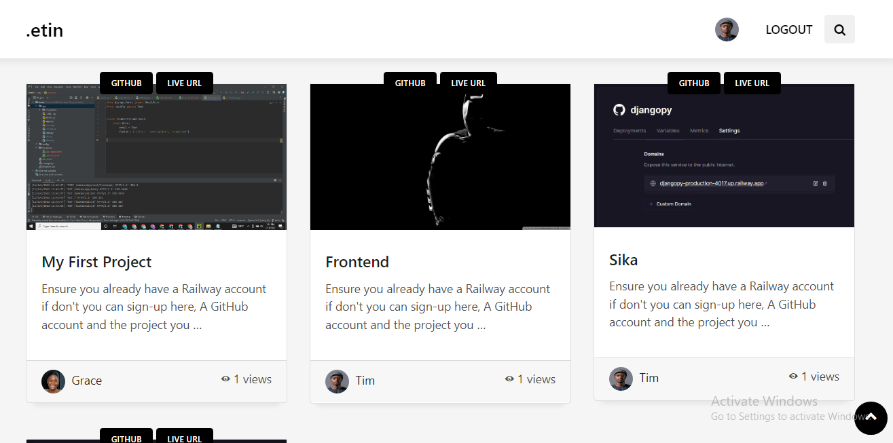
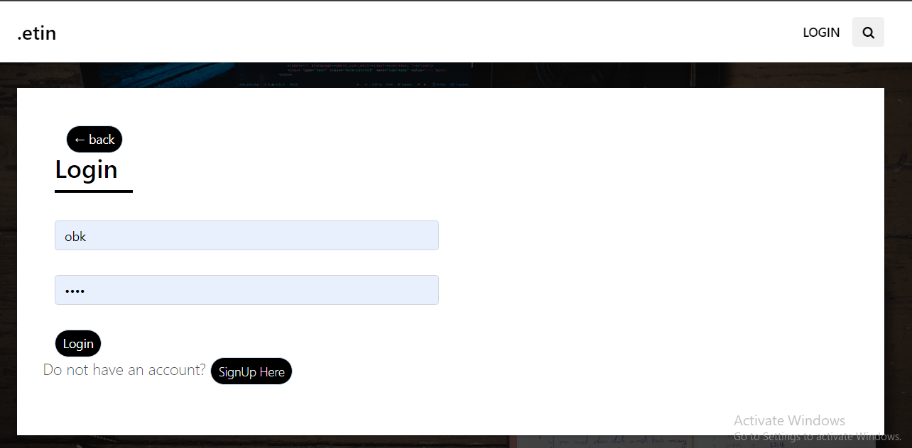
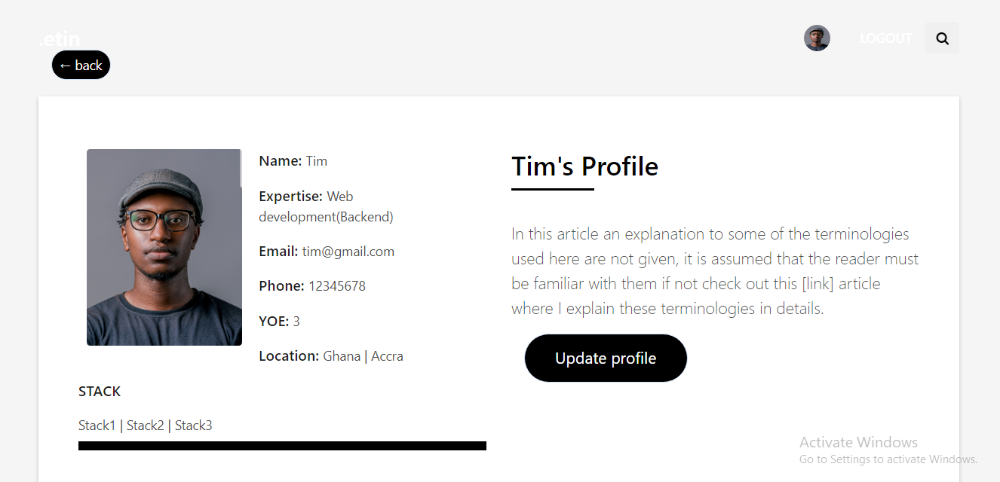
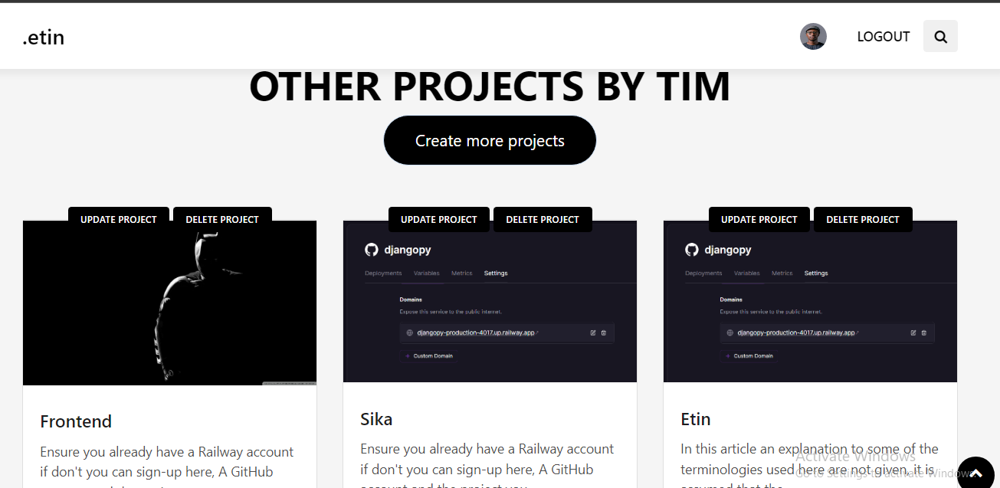
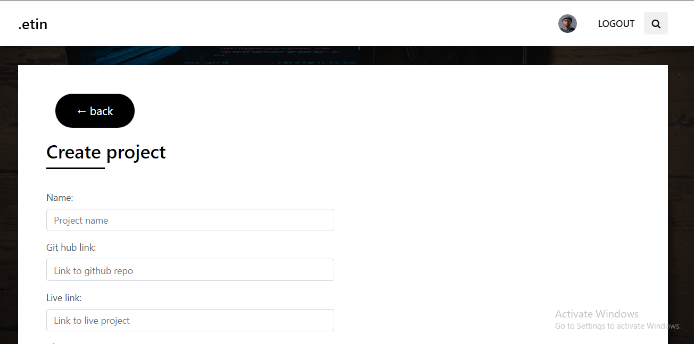
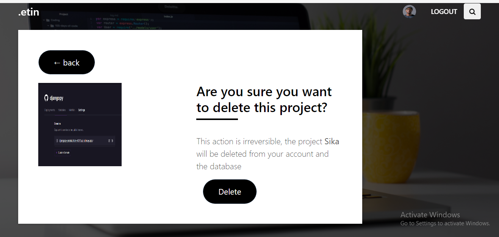
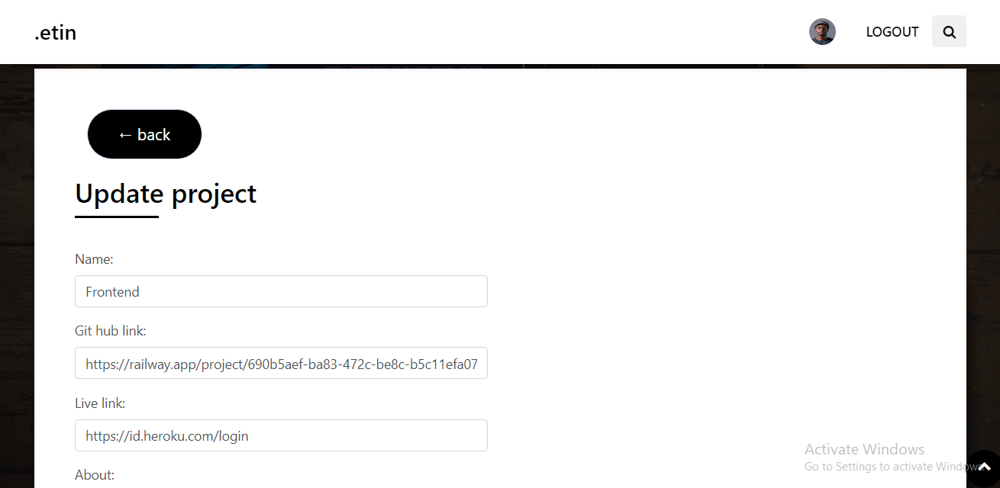

# ETIN

### PROJECT DESCRIPTION
Etin is a web application built with Django (Python web framework) Etin helps hiring managers easily access developers via the projects they create.

More...

Through this application developers can create a profile and upload their projects on the platform to showcase their skills to hiring managers.

Through this application hiring managers can search for developers based on location, expertise, stack, years of experience and so on.

One major challenge I faced while build this application was the implementation of a views count system that can be displayed based on the views/click each developers project, to solve this problem I made used of Django’s hitcount library in this article [link] I explained how to use this library on your project.

### FUTURE IMPLEMENTATION
A dropdown search function where hiring managers can make quick searches
A Chat system where hiring managers can send direct messages to which developer they chose to interview or work with.

### HOW TO RUN AND SET UP THIS PROJECT

    
More...

    Basic shit!

### HOW TO USE THE APPLICATION
You can sign up as developer create your project by filling up the necessary input field with the necessary information

Any hiring manager browsing through the website will view your profile if they find your project interesting. Below are some screenshots to better explain.

### IMAGES
#### HOME PAGE

#### LOGIN/LOGOUT/SIGNUP PAGE

#### USER PROFILE

#### PROJECT CRUD

